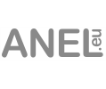

# ioBroker.anelhut

**Tests:** 

## anelhut adapter for ioBroker

Adapter for the NET-PwrCrtl Hut of ANEL Electronic AG

## Usage

-   Install adapter
    -   Go to "adapters"
    -   Install from custom URL
    -   Install or update the adapter from URL (Custom)
    -   Insert URL: https://github.com/dan1-de/ioBroker.anelhut/tarball/main
-   Configure Devices

    -   Enable UDP Communication on your Anel device
    -   Insert the properties of your Anel device

        -   DeviceName: Custom Name of your device. This name is used to display the device in the objects list. Example: anelhut.0.DeviceName
        -   DeviceIP: IP Adress of your device (please use no hostname)
        -   UDPSendPort: Insert the port which is shown in the webinterface of your Anel device. This is the recieve port from the view of the anel device.
        -   UDPRecievePort: Insert the port which is shwon in webinterface of your Anel device. This is the send port from the view of the anel device.

        Important Node: If you want to controll multiple devices, please use a different recieve port for each device
        For example you can use port 77 for the first device and 78 for the second and 79 for the third and so on
        If you only use one device, you can use the default port 77
        You can change the ports on the webinterface of the device

## Note

The development of this adapter is currently not finished. In the future i want to integrate this adapter into the official adapter list.
This adapter was only tested with two Anel "NET-PwrCtrl HUT 2C HV" but it should work with other Anel devices as well.
Please report any issues.

## Changelog

### 1.0.0

-   (dan1-de) initial release

## License

MIT License

Copyright (c) 2021 dan1-de <dan1-de@gmx.de>

Permission is hereby granted, free of charge, to any person obtaining a copy
of this software and associated documentation files (the "Software"), to deal
in the Software without restriction, including without limitation the rights
to use, copy, modify, merge, publish, distribute, sublicense, and/or sell
copies of the Software, and to permit persons to whom the Software is
furnished to do so, subject to the following conditions:

The above copyright notice and this permission notice shall be included in all
copies or substantial portions of the Software.

THE SOFTWARE IS PROVIDED "AS IS", WITHOUT WARRANTY OF ANY KIND, EXPRESS OR
IMPLIED, INCLUDING BUT NOT LIMITED TO THE WARRANTIES OF MERCHANTABILITY,
FITNESS FOR A PARTICULAR PURPOSE AND NONINFRINGEMENT. IN NO EVENT SHALL THE
AUTHORS OR COPYRIGHT HOLDERS BE LIABLE FOR ANY CLAIM, DAMAGES OR OTHER
LIABILITY, WHETHER IN AN ACTION OF CONTRACT, TORT OR OTHERWISE, ARISING FROM,
OUT OF OR IN CONNECTION WITH THE SOFTWARE OR THE USE OR OTHER DEALINGS IN THE
SOFTWARE.
